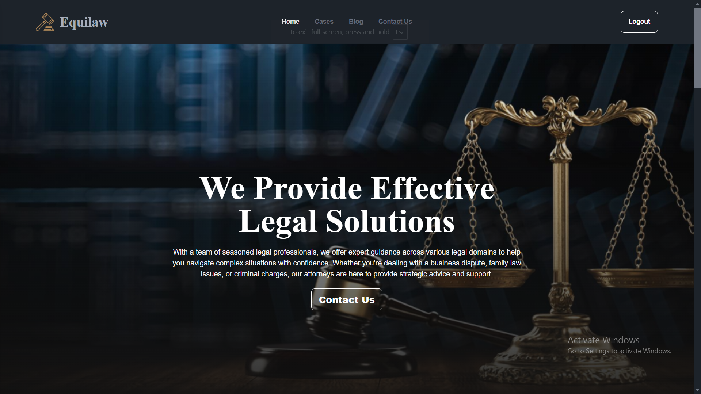

# ⚖️ EquiLaw - Legal Solutions Platform  

🔗 **Live Demo**: [EquiLaw](https://equilaw-v2.netlify.app)  

**EquiLaw** is a web-based platform designed to connect users with **legal professionals** and **resources** across various legal fields, including **Business, Criminal, Child Support, Education, and Divorce**. It features an intuitive **user interface** for clients and a **robust admin panel** for managing legal content and inquiries.  



---

## 🚀 Features  

### 🏛️ **User Panel**  
✅ **🏠 Home Page** – Overview of legal services offered.  
✅ **🔐 Login/Signup** – Secure authentication using Firebase.  
✅ **📜 Case Submission** – Users can browse cases.  
✅ **📰 Legal Blog** – Explore informative legal blogs and insights.  
✅ **📩 Contact Us** – Secure messaging system for **authenticated users** to reach the admin.  

### 🛠️ **Admin Panel**  
✅ **📊 Admin Dashboard** – Centralized management of legal content.  
✅ **📝 Blog Management** – Create, edit, and delete blog posts.  
✅ **📂 Case Management** – Create, edit, and delete cases.  
✅ **📧 Message Management** – View and reply to user inquiries.  
✅ **🔑 Secure Admin Authentication** – Only authorized admins can access the dashboard.  

---

## 🛠️ Technologies Used  

| Technology            | Description |
|-----------------------|-------------|
| **React.js**         | Frontend framework for building dynamic UI |
| **React Router**     | Handles client-side routing |
| **Tailwind CSS**     | Utility-first CSS framework for responsive styling |
| **DaisyUI**          | Component library for enhanced UI |
| **Firebase Authentication** | User authentication and security |
| **Firestore Database** | NoSQL cloud database for storing user data |
| **Netlify**          | Hosting and deployment |

---

## 📦 Dependencies  

Install project dependencies before running the application:  
```bash
npm install
```

Key dependencies from `package.json`:  
- `"react"`  
- `"react-router-dom"`  
- `"firebase"`  
- `"tailwindcss"`  
- `"daisyui"`  

---

## 🏗️ Installation & Setup  

### 🔹 Prerequisites  
Ensure you have the following installed:  
- **Node.js** → [Download](https://nodejs.org/)  
- **Firebase account** → [Firebase Console](https://console.firebase.google.com/)  
- **Netlify account** (Optional for deployment)  

### 🔹 Steps  
1️⃣ **Clone the Repository**  
```bash
git clone https://github.com/NissanJK/EquiLaw.git
cd EquiLaw
```

2️⃣ **Install Dependencies**  
```bash
npm install
```

3️⃣ **Set Up Firebase**  
- Create a **Firebase project** in the [Firebase Console](https://console.firebase.google.com/).  
- Enable **Authentication** (Email/Password).  
- Set up **Firestore Database** with a `users` collection.  
- Add Firebase configuration details in `src/utils/firebase.config.js`:  
```javascript
const firebaseConfig = {
  apiKey: "your-api-key",
  authDomain: "your-auth-domain",
  projectId: "your-project-id",
  storageBucket: "your-storage-bucket",
  messagingSenderId: "your-messaging-sender-id",
  appId: "your-app-id"
};
export const auth = getAuth(app);
export const db = getFirestore(app);
```

4️⃣ **Run the Development Server**  
```bash
npm run dev
```
- The app will be available at **http://localhost:3000/** 🚀  

---

## 📂 Folder Structure  

```plaintext
src/
├── assets/          # CSS and images
├── components/      # Reusable components
├── layout/          # Layout components (Admin/User layouts)
├── pages/           # Page components for routing
├── utils/           # Firebase configuration and utilities
├── App.jsx          # Main application component
├── main.jsx         # Entry point
```

---

## 🖥️ Interface  

### **User Interface**  
#### 📌 Home Page  
  

#### 📚 Blogs  
  

#### 📑 Case Submission  
  

#### 🔐 Login & Register  
  
  

#### ✉️ Contact Us  
  

---

### **Admin Interface**  
#### 🔑 Admin Login  
  

#### 📊 Admin Dashboard  
  

#### 📝 Manage Blogs  
  

#### 📂 Manage Cases  
  

#### 📧 User Messages  
  

---

## 🌟 Future Enhancements  

- ✅ **Live Chat Support** – Real-time communication with legal advisors.  
- ✅ **Advanced Case Tracking** – Allow users to **track progress** of their legal cases.  
- ✅ **Multilingual Support** – Support for **multiple languages** to reach a wider audience.  

---

## 📬 Contact  

📧 **Email:** [jawadul.karim78@gmail.com](mailto:jawadul.karim78@gmail.com)  
🔗 **LinkedIn:** [Jawadul Karim](https://www.linkedin.com/in/jawadul-karim-612a18318/)  

---

### 🎉 Happy Coding! 🚀  

