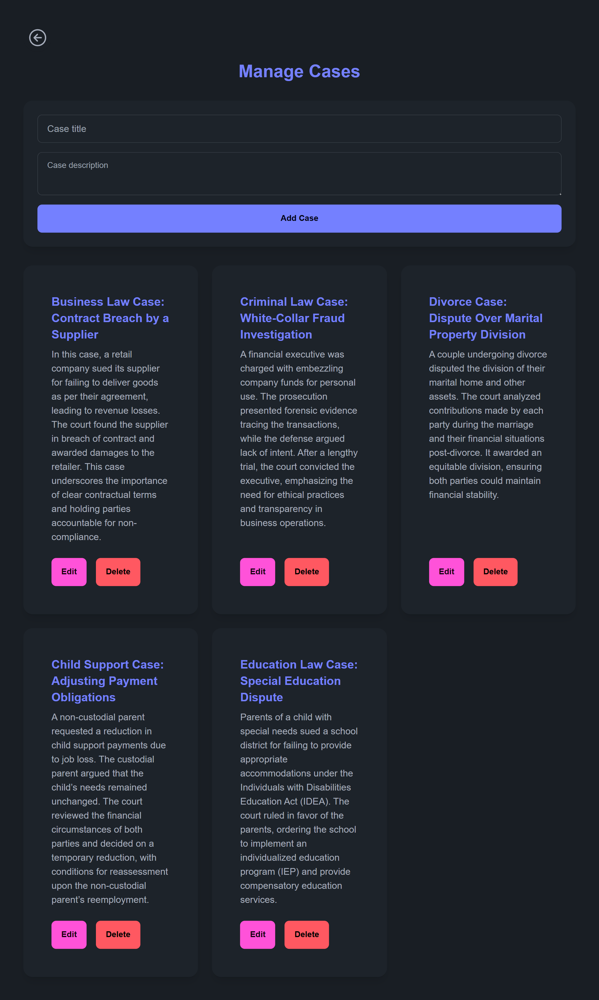

# EquiLaw

EquiLaw is a web-based legal solutions platform designed to connect users with legal professionals and resources across various areas of law, including Business, Criminal, Child Support, Education, and Divorce. The platform features a user-friendly interface for clients and a robust admin panel for managing blogs, cases, and messages.

## Features

### User Panel
- **Home Page**: An overview of the services offered by EquiLaw.
- **Login/Signup**: Secure user authentication system.
- **Cases**: Users can browse and submit cases for consultation.
- **Blog**: Explore legal blogs and insights.
- **Contact Us**: Communicate directly with the admin (only accessible for authenticated users).

### Admin Panel
- **Admin Dashboard**: Centralized management of cases, blogs, and messages.
- **Blog Management**: Add, edit, and delete blog posts.
- **Case Management**: Review and manage submitted cases.
- **Message Management**: Respond to user inquiries.
- **Admin Authentication**: Secure login for admin users.

## Tech Stack
- **Frontend**: React.js, Tailwind CSS, DaisyUI
- **Routing**: React Router
- **State Management**: React Hooks
- **Backend**: Firebase Authentication, Firestore Database
- **Deployment**: Netlify

## Installation and Setup

### Prerequisites
- Node.js (v14 or higher)
- Firebase account for authentication and Firestore
- Netlify account for deployment (optional)

### Steps
1. Clone the repository:
   ```bash
   git clone https://github.com/NissanJK/EquiLaw.git
   cd EquiLaw
   ```

2. Install dependencies:
   ```bash
   npm install
   ```

3. Set up Firebase:
   - Create a Firebase project.
   - Enable Authentication (Email/Password).
   - Set up Firestore with a `users` collection.
   - Add Firebase configuration details to `src/utils/firebase.config.js`:
     ```javascript
     const firebaseConfig = {
       apiKey: "your-api-key",
       authDomain: "your-auth-domain",
       projectId: "your-project-id",
       storageBucket: "your-storage-bucket",
       messagingSenderId: "your-messaging-sender-id",
       appId: "your-app-id"
     };
     export const auth = getAuth(app);
     export const db = getFirestore(app);
     ```

4. Start the development server:
   ```bash
   npm run dev
   ```

5. Open the application in your browser

## Folder Structure
```plaintext
src/
├── assets/          # CSS
├── components/      # Reusable components
├── layout/          # Layout components (Admin/User layouts)
├── pages/           # Page components for routes
├── utils/           # Firebase configuration and utilities
├── App.jsx          # Main application component
├── main.jsx         # Entry point
```

## Usage
### User
1. Register or log in to access features.
2. Explore blogs and submit cases for consultation.

### Admin
1. Log in to the admin panel (`/admin/login`).
2. Manage blogs, cases, and messages via the dashboard.

## Interface

- **User Interface**


- **Admin Interface**





## Future Enhancements
- Integration of live chat support.
- Advanced case tracking system for users.
- Multilingual support.

---

**Deployed Application**: [EquiLaw](https://equilaw-v2.netlify.app)
